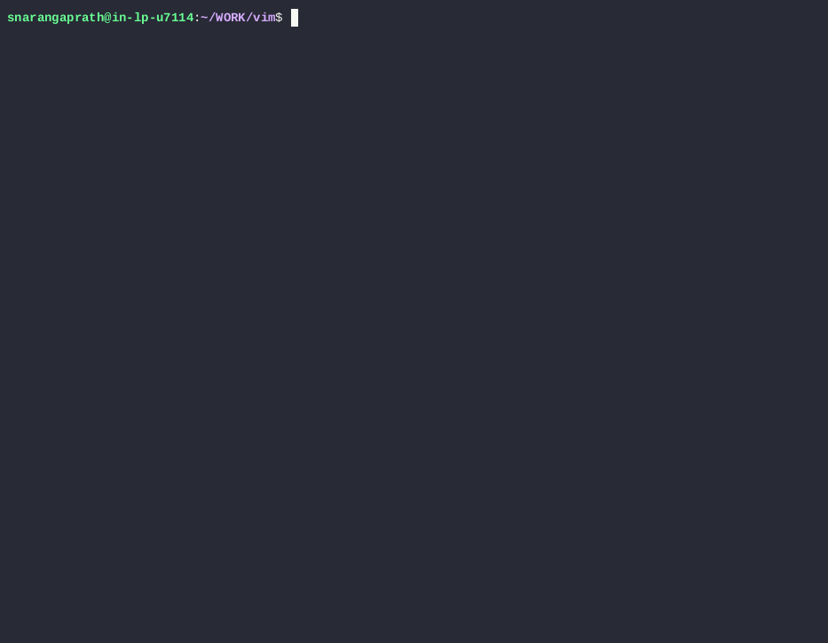
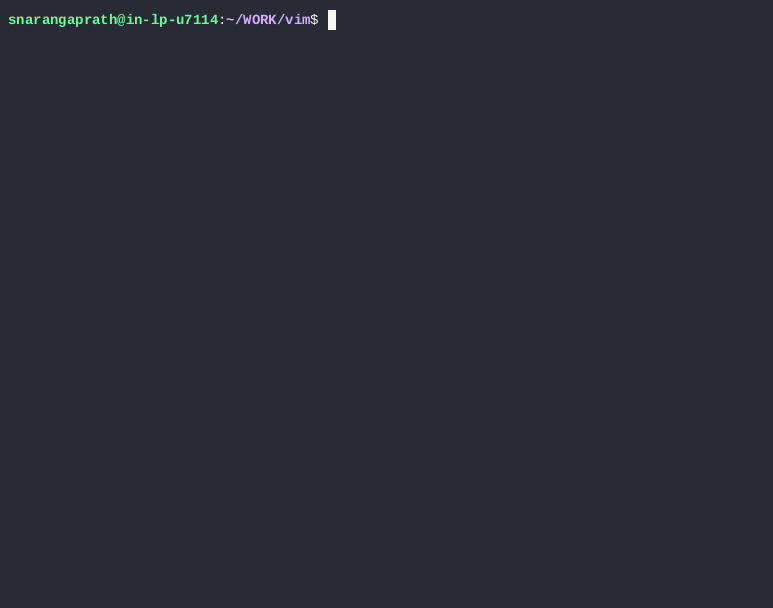
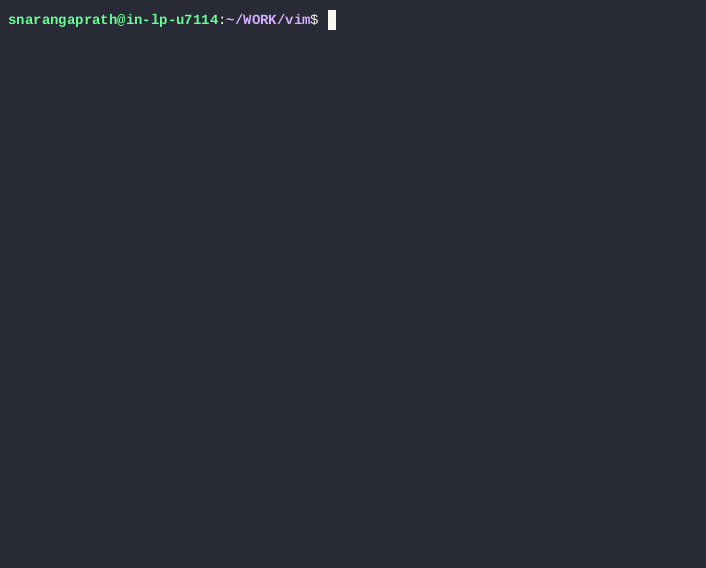
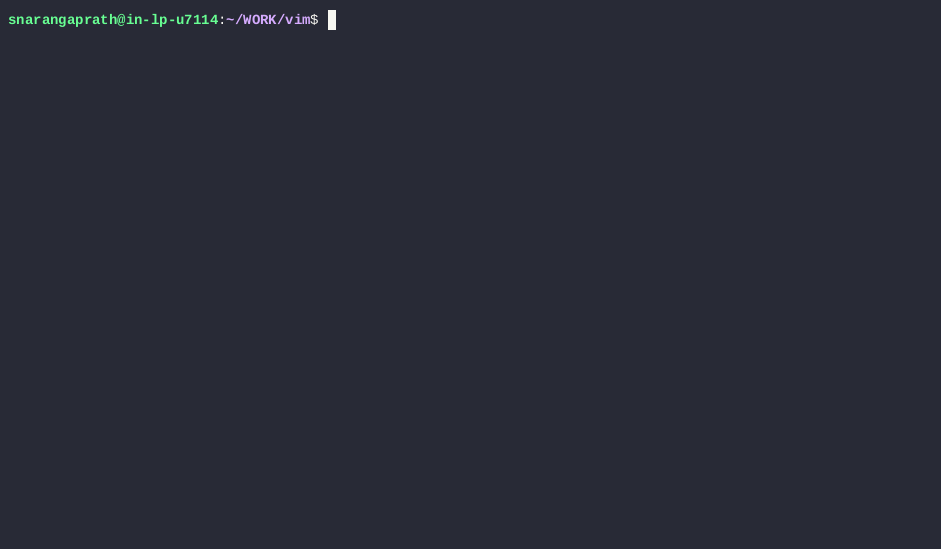

# opt_select_ncurses

`opt_select_ncurses` lets you turn any data set into an interactive selection menu in the terminal.

Whenever you have a list of data and need to select one or more items from it, this tool provides a fast, keyboard-driven interface.

---

## 🧠 How it works

Any workflow can follow this simple pattern:

1. Generate a data set
2. Pass it to `opt_select_ncurses`
3. Get user selection
4. Perform an action

You can also chain multiple scripts together to build your own workflows.

---

## ⚡ Key Features

### 🧭 Vim-style navigation

* `j / k` → move up/down
* `gg / G` → jump to start/end
* familiar and fast for developers

---

### 🔍 Search within the list

* `/` → start search (grep mode)
* regex-based matching
* `Ctrl+n / Ctrl+p` → navigate matches

---

### ⚡ Fast navigation for large lists

* `Page Up / Page Down`
* `Ctrl+d / Ctrl+u` → jump multiple items
* type a number → jump directly to that option

---

### ✅ Multi-select support

* select multiple items
* perform actions on batch

---

### ⛔ Quick exit

* `Ctrl+C` → exit anytime

---

### 🧩 Script-friendly

* works with file input or piped data
* easy to compose and chain

---

## 📸 Examples (Shell Scripts)

These are simple shell scripts built using `opt_select_ncurses`.
Each script follows the pattern: **generate data → select → act**

---

### 1. gcb (Git branch selector)

**Description:**

Generates a list of Git branches, lets the user select one interactively, and performs the checkout on the selected branch.

**Demo:**



---

### 2. fops (File operations selector)

**Description:**

Takes one or more files as input, presents a list of possible actions, lets the user choose an operation interactively, and executes it on the selected files.

**Flow:**

files → select action → execute

**Demo:**



---

### 3. vif (Find and perform actions on file)

**Description:**

Searches for files based on input, lets the user select one if multiple matches are found, and passes the selected file to `fops` to perform actions on it.

**Flow:**

find → select file → fops → execute

**Demo:**



---

### 4. gsvi (perform selected action on git modified files)

**Description:**

Lists modified files from Git status, allows the user to select one or more files (multi-select), and passes the selected files to `fops` to perform the chosen action.

**Flow:**

git status → select files → fops → execute

**Demo:**


---

### 5. grepopt (Search and perform actions on results)

**Description:**

Searches for a given text recursively in the current folder, lets the user select an occurrence, and passes the selected file to `fops` to perform actions on it.

**Flow:**

grep → select occurrence → fops → execute

**Demo:**



---

## 🧠 Possible use cases

This tool can be used anywhere you need to select from a list of data:

* Select and **restart a system service**
* Choose an **SSH host to connect to**
* Pick and **kill a running process**
* Select a **Docker container to inspect or stop**
* Choose a **Kubernetes context to switch**
* Select a **log file to monitor**
* Select and **restore a named screen session**

---

## Syntax

```bash id="2m6n2c"
opt_select_ncurses [in_file=<input_file>] [out_file=<output_file>] [multi_select=yes] [default=<value>] [from_pipe=yes/no] [udp_dbg_port=<udp_dbg_server_port>] [-h for help]
```

| Option         | Description                                      |
| -------------- | ------------------------------------------------ |
| `in_file`      | Input options are read from this file            |
| `out_file`     | Selected result is written to this file          |
| `multi_select` | Enable multi-select                              |
| `default`      | Default selected index                           |
| `from_pipe`    | Read input from pipe                             |
| `udp_dbg_port` | Debug logs via UDP (use `nc -k -l -u -p <PORT>`) |
| `-h`           | Show help                                        |

---

## Installation (Build from source - recommended)

```bash id="l3c7hi"
git clone https://github.com/shyjun/opt_select_ncurses.git
cd opt_select_ncurses
make
sudo make install
```

---

### Add to PATH (if needed)

```bash id="6a0k6p"
export PATH=$PATH:/usr/local/bin
```

Add to `~/.bashrc` or `~/.zshrc` to make it permanent.

---

### Verify installation

```bash id="bb5xys"
which opt_select_ncurses
opt_select_ncurses --help
```

---

## Dependency

Requires ncurses:

```bash id="u9zqv4"
sudo apt install libncurses-dev
```

---

## Key bindings

### Normal Mode

| Key            | Action           |
| -------------- | ---------------- |
| `j / k`        | Down / Up        |
| `Ctrl+n / p`   | Down / Up        |
| `gg / G`       | First / Last     |
| `Ctrl+d / u`   | Jump             |
| `Page Up/Down` | Scroll           |
| `Enter`        | Select           |
| `Space`        | Toggle selection |
| `Esc`          | Exit             |
| `Ctrl+C`       | Exit anytime     |

---

### Search Mode (`/`)

| Key          | Action                |
| ------------ | --------------------- |
| `/`          | Start search          |
| `Ctrl+n / p` | Next / Previous match |
| `Esc`        | Exit search           |

---

## Author

**Shyju N** ([n.shyju@gmail.com](mailto:n.shyju@gmail.com))
